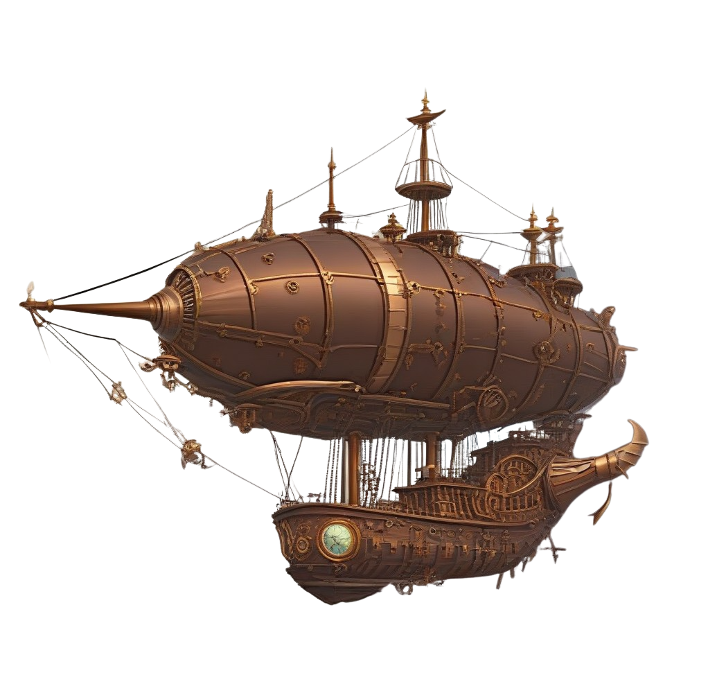

# CHEVERSE

Welcome to CHEVERSE, where we will create a fully decentralized parallel universe on the Internet. Set against the backdrop of a contentious, unfair, and chaotic continent, the CHE organization has begun the revival of the Che Guevara plan, cultivating revolutionary cells of Che Guevara using the characteristics of blockchain technology in a secret base on the network. The cultivated cells are successfully implanted into new life forms after passing tests. The CHE organization is well aware of the current state of the modern gaming industry and has decided to adopt Che Guevara's revolutionary spirit to break the monopoly system and unleash the creativity of players.

In the parallel universe of CHEVERSE, we will construct a complete social system through the form of games. The name CHEVERSE is derived from the great revolutionary leader Che Guevara, symbolizing uniqueness, the pursuit of rebellion, and authentic cultural symbols. Ultimately, we will build the entire CHEVERSE based on this spirit.

## PUBLIC GAME

What is PUBLIC GAME?

- Once established, PUBLIC GAME is unstoppable, creating a positive and shared economic system built by all participants.
- It features Universal Basic Income (UBI), where all participants share the income generated by the protocol itself. The income is obtained through the Harberger Tax, and the generated revenue is used to issue tokens to users as collateral.
- It does not require permission and operates on a trusted neutral platform.
- It is self-generative. Anyone can build their own applications, ecosystems, and economic systems (issuing tokens) within the game, driving the game's growth independently rather than being driven by the game's founding team.
- It emphasizes governance and the game mechanism is closely tied to governability. Users determine the direction of ecosystem development through quadratic voting within the application.
Value introduction: Anyone can introduce value in some form.

The Creativity from Bottom to Top

We fully agree with the vision of Dom Hoffmann, the creator of LOOT, and have drawn much inspiration from it. Value should not be solely attributed to individuals; it requires the power and consensus of the community from the bottom up. If LOOT can be likened to seeds, then we hope to plant all these seeds in one piece of land.

We will not limit any imagination and welcome the contribution of all developers to shape the value of these resources. This aligns more with the philosophy of CHE, allowing for free development and breakthroughs in technological challenges. In the CHEVERSE, nothing exists without value.

## Character

All characters will be established and imported from CHECELL into CHE.WORLD.
Players are free to choose their identities in CHE.WORLD, whether they want to be merchants or adventurers. We hope that players can do what they want and become who they want to be.

## Attributes

Leadership: Controls the combat effectiveness of troops.
Creativity: Controls the resource limit and output efficiency.
Business Acumen: Controls the tax reduction range during trade.
Social Skills: Controls the maximum distance for a single voyage and the maximum number of allies.
Dominance Value: Each city has a different dominance value, which is determined by land ownership, military strength, and the percentage of pledged currency."

## Equipment

Each character can have equipment for 8 slots, and upon character creation, they will randomly receive one piece of equipment.
Users who own LOOT can import their LOOT onto their characters.
Players without LOOT can craft equipment using the forging function, which requires a significant amount of resources.

## Cities

There are a total of 200 regions, each consisting of multiple C&C (Control and Command) units. All the C&C units contribute to the regional value of that area. Currently, C&C units are held by users and require logging into CHE.WORLD to submit proof. Users who hold C&C units can receive regional tax revenue and a portion of the dominance value.

### Dominance Value
The dominance value of each character varies in each region, and the dominance value determines the player's permissions in that region. Once certain requirements are met, the following features will be unlocked: tax adjustments, toll adjustments, currency issuance, etc.
Dominance value = Conversion value of the number of C&C units held in that region + Conversion value of the number of airships + Conversion value of currency collateralization.

## Resources

Resource Distribution: Each region will have its own unique resources, with a current total of 200 types. When players collateralize currency in the mining pool, resource output will be generated.

Resource Usage: Each resource has a value that determines its effectiveness when used for crafting or upgrading airships. Using multiple different materials may yield better results, requiring players to engage in research and exploration.

Resource Addition: Since the quantity of currency corresponds to the amount of resource output, but the total output of each resource is fixed, there will come a day when all resources in a region are depleted. If new resource deposits are needed, external resources must be introduced. For example, if a user collateralizes 5 BNB in that region, there will be corresponding resource output worth 5 BNB.

## Taxation

Taxation consists of three parts: mineral tax, toll tax, and ship tax. All taxes will enter the regional tax contract and be distributed to users in that region based on dominance value.
Mineral Tax: When a user purchases another user's mine, they will be required to pay a certain amount of mineral tax. The amount of mine tax will depend on the user's business acumen and the quantity of mineral purchases.
Toll Tax: When your cargo ship needs to pass through someone else's region, you will need to pay a certain fee. The fee is calculated based on the resources you carry and the total value of your airship.
Ship Tax: For NFTs minted by players, holding these NFTs requires paying a monthly ship tax, which is 1% of the sale price set by the player for the airship.

## Currency

The unified currency in CHE.WORLD is CHEGOLD. Currently, the primary use of currency in the game is for collateralized mining. Additionally, various types of taxes also need to be paid in CHEGOLD.

## Airships

Airships are transportation, logistics, and combat tools in CHE.WORLD that can be constructed, modified, and upgraded. The number of airships a player owns is equivalent to their military strength.

## Construction Method
Construction requires the consumption of materials, with no limitations on the quantity and types of materials. Up to 5 different resource materials can be used. Different combinations of resource materials will affect the attributes and modification properties of the airship.
